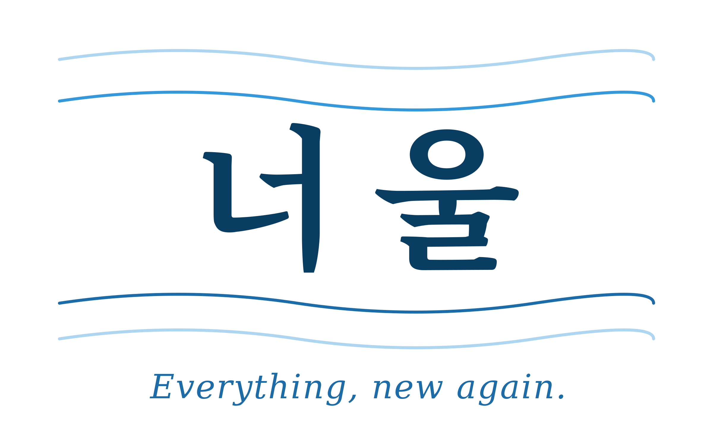

# 너울 — 교육자료 배포 시스템

> **오늘의 한 물결이, 내일의 너울이 된다**
>
> *"Everything, new again." — 너울 · NEO + UL (New + All)*



---

## 📌 프로젝트 개요

**너울**은 대한민국 고등학생·재수생을 위한 **수능 학습자료 배포 시스템**입니다. 사회탐구·과학탐구·한국사 등 19개 과목의 문제집·정답지를 구글 드라이브와 연동하여 실시간으로 배포합니다.

본 시스템은 **김태민** 개인이 창작·개발한 교육용 소프트웨어이며, **'너울' 상표**로 실제 운영되고 있는 **교육자료 배포업** 서비스의 핵심 구성요소입니다.

### 🎓 배포 학습자료의 출처

본 시스템이 배포하는 **모든 문제집·해설·요약집**은 **저작권자 김태민이 직접 출제·집필한 교육 저작물**입니다. 외부 기관의 자료를 재가공한 것이 아닌, 김태민 본인이 수능 대비 지도 경험을 바탕으로 **직접 작성한 창작물**입니다.

### 📚 학습자료 운영 형태

| 카테고리 | 운영 형태 | 파일 구성 |
|---------|---------|---------|
| **사회탐구** (9과목) | 회차별 문제편 + 해설편 | 1회차당 2파일 1세트, **O/X 선택형** |
| **과학탐구** (8과목) | 회차별 문제편 + 해설편 | 1회차당 2파일 1세트, **O/X 선택형** |
| **한국사** | 단일 통합본 | 핵심용어 및 사건정리 1파일 |
| **경제이론요약집** | 단일 통합본 | 요약집 1파일 |

> 📋 **출제 기준**: 모든 회차 문제는 기본(40%) + 응용(40%) + 고난도(20%) 비율로 구성되며, 2015 개정 교육과정 + EBS 수능특강·수능완성 100% 연계 출제됩니다.

---

### 브랜드 정보

| 항목 | 내용 |
|------|------|
| **브랜드명** | 너울 (국문 문자 상표) |
| **상표 유형** | 국문 문자 상표 단독 출원 |
| **슬로건** | 오늘의 한 물결이, 내일의 너울이 된다 |
| **저작권자 · 상표 출원인** | 김태민 |
| **상표 출원번호** | TN26005859KJ |
| **지정상품 (9류)** | 교육용 소프트웨어, 내려받기 가능한 전자문서, 전자학습지, 데이터베이스 SW, 문서관리 SW |
| **지정서비스 (41류)** | 교육 분야 정보제공업, 교육시험제공업, **교육자료 배포업**, 온라인 교육시험업 |
| **최초 공개일** | 2026-04-24 |

---

## 🎯 핵심 기능

### 1. 학습자료 배포 (교육자료 배포업)

- **19개 과목** 문제집·정답지 원클릭 다운로드
- **혼합 폴더 구조 자동 인식**:
  - 사회탐구·과학탐구: `[과목]/문제집/` (문제편) + `[과목]/정답지/` (해설편) 분리 폴더
  - 한국사·경제이론요약집: `[과목]/` 직접 파일 구조 (단일 통합본)
- **구글 드라이브 연동**: 실시간 파일 동기화
- **저작권자 직접 출제 자료**: 외부 자료 재가공이 아닌 김태민 본인 창작물

### 2. 다운로드 통계 (교육용 소프트웨어)

- 실시간 다운로드 로그 기록
- 일간·주간·월간 통계 대시보드
- 과목별·회차별 인기도 분석

### 3. 너울 학습자료 체계 (전체 김태민 본인 출제)

| 카테고리 | 과목 |
|---------|------|
| **사회탐구** | 한국지리, 정치와법, 윤리와사상, 세계지리, 세계사, 생활과윤리, 사회문화, 동아시아사, 경제 |
| **과학탐구** | 화학1·2, 지구과학1·2, 생명과학1·2, 물리학1·2 |
| **기타** | 한국사, 경제이론요약집 |

---

## 🏗️ 기술 스택

- **백엔드**: Google Apps Script
- **저장소**: Google Drive
- **로그 DB**: Google Sheets
- **프론트엔드**: HTML5 + CSS3 + Vanilla JavaScript
- **호스팅**: Google Apps Script Web App

---

## 🚀 배포 URL

- **깃허브 저장소**: https://github.com/Ladisiong/neoul-download
- **너울 학습자료 배포 시스템 (Vercel)**: `https://neoul-download.vercel.app` *(D-2 배포 후 업데이트)*
- **Apps Script 웹앱 엔드포인트**: D-3 작업 시 발급되는 본인의 실제 URL로 교체 *(보안상 README에는 미공개)*
- **공식 유튜브 채널**: `https://youtube.com/@너울-공식` *(D-2 개설 후 업데이트)*

> 🔒 **보안 가이드라인**: Apps Script 웹앱 URL과 Drive Folder ID, Spreadsheet ID는 본 저장소가 Public이므로 코드에는 플레이스홀더만 표기되어 있습니다. 실제 운영 값은 Apps Script 편집기와 Vercel 환경변수에서만 보관합니다.

> 🔍 **상표 증거 확인 엔드포인트**: 본인의 Apps Script URL에 `?action=getBrandInfo`를 붙여 호출하면 출원인·상표 출원번호·학습자료 운영 형태가 JSON으로 반환됩니다.

---

## 📂 프로젝트 구조

```
neoul-download/
├── README.md                                    # 본 문서 (브랜드·상표 정보)
├── LICENSE                                      # 저작권 고지 (김태민)
├── apps_script/
│   └── Code.gs                                  # Google Apps Script 백엔드
├── frontend/
│   ├── index.html                               # 메인 페이지 (국문 너울 + 영문 태그라인)
│   ├── app.js                                   # 파일 다운로드 로직
│   └── assets/                                  # 프론트엔드 참조용 로고 미러 (8종)
│       ├── neoul-logo-horizontal.png + .svg
│       ├── neoul-logo-horizontal-tagline.png + .svg
│       ├── neoul-mark-square.png + .svg
│       └── neoul-mark-square-tagline.png + .svg
├── assets/                                      # 로고 원본 (8종 = PNG 4 + SVG 4)
│   ├── neoul-logo-horizontal.png                # 수평형 로고 (심볼 + 한글 너울)
│   ├── neoul-logo-horizontal.svg                # 수평형 로고 SVG 벡터 원본
│   ├── neoul-logo-horizontal-tagline.png        # 수평형 로고 + 태그라인 (공식)
│   ├── neoul-logo-horizontal-tagline.svg        # 수평형 + 태그라인 SVG 벡터 원본
│   ├── neoul-mark-square.png                    # 정사각 마크 (앱 아이콘·프로필)
│   ├── neoul-mark-square.svg                    # 정사각 마크 SVG 벡터 원본
│   ├── neoul-mark-square-tagline.png            # 정사각 마크 + 태그라인
│   └── neoul-mark-square-tagline.svg            # 정사각 + 태그라인 SVG 벡터 원본
└── evidence/                                    # 상표 증거 자료 (변리사 제출용)
    ├── 04-4_학습자료_저작권_자가고지서_v2.2.pdf  # 자가 고지서 PDF (서명 필요)
    ├── 04-4_학습자료_저작권_자가고지서_원본.html  # PDF 편집 추적용 HTML 원본
    ├── 06_declaration_p1.png                    # 자가 고지서 1페이지 미리보기
    └── 09_subject_grid_19.png                   # 19과목 그리드 스크린샷
```

> 💡 **Vercel 배포 시 Root Directory**: `frontend/` 폴더를 루트로 지정 (D-3 가이드 5단계 참조).

---

## 🎨 브랜드 디자인 시스템

### 컬러 시스템 (너울 SSoT)

| 이름 | HEX | 용도 |
|------|------|------|
| 딥 블루 | `#0A3D62` | 주요 타이포·심볼·신뢰의 축 |
| 오션 블루 | `#1B6CA8` | 서브 타이포·표 강조 |
| 스카이 블루 | `#3498DB` | 액센트·링크·희망의 축 |
| 라이트 웨이브 | `#AED6F1` | 배경·잔물결 레이어 |
| 소프트 미스트 | `#EAF4FB` | 섹션 배경·인용구 |

### 타이포그래피 (한글 전용)

| 구분 | 폰트 | 용도 |
|------|------|------|
| **제목** | Noto Serif KR (본명조) | 브랜드명·헤드라인·공식 문서 |
| **본문** | Pretendard · Noto Sans KR | 디지털 본문·UI·대시보드 |

---

## 📖 너울의 브랜드 서사

> '너울'은 바다의 크고 넓은 파도, 거대한 흐름을 뜻하는 순우리말입니다.
> 잔잔한 물결 하나로는 아무것도 바꾸지 못합니다.
> 그러나 그 물결이 쌓이고 쌓여 너울이 될 때, 누구도 막을 수 없는 변화가 시작됩니다.

### 너울 · NEO + UL (New + All)

'너울'이라는 이름 속에는 또 하나의 의미가 숨어 있습니다. **NEO**는 '새로움'을, **UL**은 'All'을 뜻합니다. 모든 것을 새롭게 — **"Everything, new again."** 이것이 너울이 추구하는 교육의 본질입니다. 한글의 물결과 영문의 혁신이 만나는 브랜드 서사입니다.

### 철학적 뿌리

너울의 5회독 누적 철학은 주자학의 **활연관통(豁然貫通)** — '작은 배움이 쌓이다 어느 순간 막혔던 이치가 뚫려 큰 흐름이 된다'는 조선 교육이념에 뿌리를 둡니다. 율곡 이이의 **격몽요결(擊蒙要訣)** — '어리석음을 깨는 첫걸음' — 과 현대 인지과학의 **에빙하우스 망각곡선**이 만나는 지점에서, 너울의 5회독 시스템이 시작됩니다.

---

## ⚙️ 설치 및 실행

### 1. Apps Script 배포

```
1. Google Apps Script 프로젝트 생성
2. apps_script/Code.gs 내용 복사
3. FOLDER_ID, SPREADSHEET_ID 본인 값으로 교체
   (본 저장소 코드에는 플레이스홀더만 표기됨 — 보안 가이드라인)
4. 웹앱으로 배포 (실행: 나, 접근: 모든 사용자)
```

> 🔒 **보안 운영 원칙**:
> - 본 깃허브 저장소는 Public이므로 코드에는 `YOUR_DRIVE_FOLDER_ID`·`YOUR_LOG_SHEET_ID`·`YOUR_APPS_SCRIPT_WEBAPP_URL` 플레이스홀더만 표기
> - 실제 운영 ID는 Apps Script 편집기 내부에서만 사용 (절대 공개 코드에 푸시 금지)
> - 플레이스홀더가 그대로 깃허브에 푸시되었는지 D-3 작업 7-4 단계에서 점검

### 2. 프론트엔드 호스팅

```
git clone https://github.com/Ladisiong/neoul-download.git
cd neoul-download
# Vercel 배포: Root Directory를 frontend 로 설정
# app.js의 API_URL을 본인의 Apps Script URL로 교체 (Vercel 환경변수 권장)
```

### 3. 브랜드 정보 확인 (상표 증거용 엔드포인트)

```
curl "https://script.google.com/macros/s/AKfycbx30z-z93T4YYSgjwFSXdj5zb0x5PID5FZzO2Byj7gEjnszuWCp0PCyy0NnNb6x5kYWWA/exec?action=getBrandInfo"
```

응답 예시:
```json
{
  "brand": "너울",
  "copyright_holder": "김태민",
  "trademark_application": "TN26005859KJ",
  "trademark_type": "국문 문자 상표",
  "service_category": "교육용 소프트웨어 · 교육자료 배포업",
  "content_origin": "김태민 본인 출제·집필 수능 대비 학습자료",
  "content_format": {
    "social_science": "회차별 문제편 + 해설편 (2파일 1세트, O/X 선택형)",
    "natural_science": "회차별 문제편 + 해설편 (2파일 1세트, O/X 선택형)",
    "korean_history": "핵심용어 및 사건정리 단일 통합본",
    "economic_theory": "요약집 단일 통합본"
  }
}
```

---

## 📜 저작권 및 상표권 고지

### 저작권

© 2026 **김태민**. All rights reserved.

본 소프트웨어의 모든 소스 코드, 문서, 디자인은 **김태민 개인의 저작물**이며, 대한민국 저작권법에 의해 보호됩니다. 무단 복제·배포·상업적 이용을 금지합니다.

### 학습자료 저작권 (특별 고지)

본 시스템이 배포하는 **모든 학습자료(문제집, 해설, 요약집)**은 저작권자 **김태민이 직접 출제·집필한 교육 저작물**입니다.

**운영 형태별 저작물 구성:**
- **사회탐구·과학탐구**: 회차별 문제편 PDF + 해설편 PDF = 2개 파일 1세트로 운영. 모든 문제는 O/X 선택형이며, 기본·응용·고난도 비율(40:40:20)로 출제됨.
- **한국사**: 핵심용어 및 사건정리 단일 통합본 1파일 (회차·해설 분리 없음).
- **경제이론요약집**: 요약집 단일 통합본 1파일 (회차·해설 분리 없음).

**저작권 귀속 사실:**
- 외부 기관이나 제3자의 저작물을 재가공·전재한 것이 아님
- 수능 대비 지도 경험을 바탕으로 한 김태민 본인 창작물
- 저작권법 제2조 제1호에 따른 **인간의 사상 또는 감정을 표현한 창작물**로서 단독 저작물에 해당
- 모든 저작재산권(제16조~제22조) 및 저작인격권(제11조~제13조)이 **김태민 개인에게 단독 귀속**

### 상표권

- **'너울'** 은 김태민이 특허청에 출원한 **국문 문자 상표**입니다 (출원번호: **TN26005859KJ**).
- 9류(상품) 및 41류(서비스) 지정 상품/서비스에 대한 상표권이 출원되어 있습니다.
- 본 저장소는 '너울' 국문 상표의 **실제 사용 증거**로 활용됩니다.

### 라이선스

이 프로젝트는 **저작권자 허가 없이 재배포·상업적 이용이 불가**합니다. 교육 목적의 학습용 코드 참조만 허용됩니다.

---

## 📞 연락처

- **저작권자 · 상표 출원인**: 김태민
- **프로젝트 문의**: GitHub Issues
- **상표 관련 문의**: 출원 대리인 변리사

---

## 🔖 변경 이력

| 버전 | 날짜 | 변경 내용 |
|------|------|----------|
| 1.0.0 | 2026-04-24 | **너울 브랜드 공식 런칭**. 교육자료 배포 시스템 v1 공개. 저작권자 김태민 명시. 상표 출원번호 TN26005859KJ 명시. 배포 학습자료는 김태민 본인 출제 교육 저작물임을 명시. |
| 1.1.0 | 2026-04-25 | **학습자료 운영 형태 명시화 (v2.2 정합)**. 사회탐구·과학탐구를 회차별 문제편·해설편 2파일 1세트로 운영함을 명시. 한국사를 핵심용어 및 사건정리 단일 통합본으로 운영함을 명시. 경제이론요약집을 단일 통합본으로 운영함을 명시. `getBrandInfo` 응답에 `content_format` 및 `folder_structure` 필드 추가. README·Code.gs·index.html·LICENSE 일관성 정합. |
| 1.1.1 | 2026-04-25 | (내부 검토용) 운영 인스턴스 ID 코드 반영 시도. 보안 검토 후 v1.1.2에서 회수. |
| 1.1.2 | 2026-04-25 | **보안 가이드라인 회복 (D-3 가이드 7-4 정합)**. `Code.gs`의 `FOLDER_ID`·`SPREADSHEET_ID`를 플레이스홀더로 복원. `app.js`의 `API_URL`을 플레이스홀더로 복원 + 데모 모드 분기 복원. README의 배포 URL 섹션과 curl 예시를 일반 자리표시자로 복원. 깃허브 공개 저장소 노출 위험 차단. 깃허브 저장소 URL은 안전하므로 LICENSE에 유지. |

---

**오늘의 한 물결이, 내일의 너울이 됩니다.**

*© 2026 김태민 · 너울 · 상표 출원번호 TN26005859KJ*
